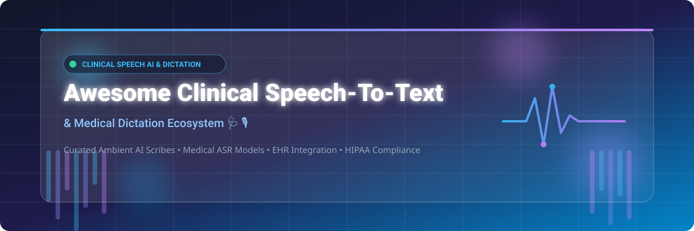

# Awesome-Clinical-Speech-To-Text-Medical-Dictation

# Awesome-Clinical-Speech-To-Text-Medical-Dictation 🩺 🎙️



  





  
  
  
  
  
  



---

## 🌟 Top Clinical Speech-to-Text & Medical Dictation Ecosystem

**Curated List of Commercial Clinical Documentation Platforms & Open-Source Medical ASR Models**  
*Focused on Medical Dictation, Ambient Clinical Intelligence, EHR Integration, HIPAA Compliance & Self-Hosted Medical Transcription*

**Last updated: October 2026** 📅

---

### 📌 Overview & SEO Summary
Welcome to the ultimate curated directory of **clinical speech-to-text platforms**, **open-source medical ASR models**, and **ambient clinical intelligence solutions**. Whether you are looking for enterprise-grade commercial solutions (such as *Nuance Dragon Medical One*, *Abridge*, and *Ambience Healthcare*), or self-hostable open-source alternatives (like *MedASR*, *MedWhisper*, and *VoxRad*), this list covers category leaders, medical-domain language models, and privacy-respecting clinical documentation pipelines.

---

## 📑 Table of Contents
- [🏢 SaaS & Commercial Platforms](#-saas--commercial-platforms)
- [🔓 Open-Source GitHub Projects](#-open-source-github-projects)
- [🛠️ How to Contribute](#%EF%B8%8F-how-to-contribute)
- [📊 Star History](#-star-history)
- [🤝 Support & Sponsorship](#-support--sponsorship)
- [⚠️ Disclaimer](#%EF%B8%8F-disclaimer)

---

## 🏢 SaaS / Commercial Platforms

The clinical speech-to-text market is dominated by enterprise-focused vendors with per-clinician subscription models. **Nuance Dragon Medical One** remains the incumbent with a **$809,811.85 AUD** government contract for a single year , while **DeepScribe** starts at **$400–$600/month** per provider with premium plans exceeding **$750/month** . **Abridge** charges **$199 per physician per month** with enterprise discounts , **Ambience** lists at **$250 per physician per month** , and **Augmedix** uses hybrid human+AI models benchmarked at **$300–$700+ per clinician per month** . Most vendors do not publish pricing publicly and require sales engagement .

| SaaS / Commercial Platform | Company / Owner | Valuation / Market Cap | Standard Edition Starting Price | Free Tier / Free Trial Limits | Description |
| :--- | :--- | :--- | :--- | :--- | :--- |
| **[Nuance Dragon Medical One](https://www.nuance.com/healthcare/dragon-medical-one.html)** 🐉 | Microsoft (Nuance) | ~$3.90 Trillion | Government contract: **$809,811.85 AUD** for 1 year  | No free tier; enterprise sales only | **The incumbent clinical dictation standard** — Cloud-based voice recognition with medical vocabulary. Deep EHR integration (Epic, Cerner, etc.). Used by hundreds of thousands of clinicians worldwide. |
| **[DeepScribe](https://www.deepscribe.ai/)** 📝 | DeepScribe | Private | **$400–$600/month** per provider; premium plans **$750+/month**  | **No public pricing, no free trial, no self-serve**  | **Enterprise ambient AI scribe** — KLAS score 98.8/100, highest in ambient AI category . Specialty-focused with structured output. HIPAA-compliant, SOC 2 Type 2 certified. |
| **[Abridge](https://www.abridge.com/)** 🌉 | Abridge | Private | **$199 per physician per month**  | Enterprise volume discounts available  | **AI-powered clinical documentation** — Converts patient-clinician conversations into structured clinical notes in real-time. Clinician users report time savings, improved patient interaction, and would recommend to colleagues . |
| **[Suki AI](https://www.suki.ai/)** 🎤 | Suki AI | Private | **Free** with in-app purchases; monthly/annual subscriptions with free trials  | Free tier available; subscription unlocks unlimited readings | **Voice-enabled AI assistant** — Dictation and ambient documentation. Mobile app for iPhone. Free tier allows limited readings. |
| **[Augmedix](https://www.augmedix.com/)** 🏥 | Augmedix (Commure) | Private | **$300–$700+ per clinician per month** (hybrid human+AI benchmark)  | Pilots available through enterprise sales; no self-serve free tier  | **Hybrid human + AI scribe** — Three tiers: Go (self-service AI), Assist (hybrid with human editing), Live (full clinical workflow support). Daily EHR time savings: 1–3 hours depending on tier . |
| **[Ambience Healthcare](https://www.ambiencehealthcare.com/)** 🏥 | Ambience | Private | **$250 per physician per month**  | Enterprise volume discounts available  | **Ambient charting and coding platform** — Sells to health systems. No published pricing, trial, or self-serve tier; demo form is the only route to quote . |
| **[Nabla Copilot](https://www.nabla.com/)** 📋 | Nabla | Private | **Contact sales**; free tier with volume limits  | **Free tier available** with volume limits; **BAA not confirmed on free tier**  | **Ambient scribe + real-time dictation** — Nabla Copilot (ambient) and Nabla Dictation (at-cursor voice-to-text). Providers needing BAA for HIPAA must use paid plan . |
| **[Robin Healthcare](https://www.robinhealthcare.com/)** 🏥 | Robin Health | Private | **Freemium model** — consumer app free; paid pro version for doctors  | Free consumer tier; pro version paid | **Digital preventive health platform** — Sits between patient and physician. Turns prevention into personalized plan . |
| **[Sopris Health](https://www.soprishealth.com/)** 🏔️ | Sopris Health | Private | **Custom pricing** — contact vendor; **no free trial**  | No free trial available  | **Clinical documentation platform** — Enterprise sales only. Pricing not published. |
| **[Amazon Transcribe Medical](https://aws.amazon.com/transcribe/medical/)** ☁️ | Amazon | ~$2.0 Trillion | Pay-as-you-go per second of audio | **Free tier: 60 minutes/month for 12 months** | **AWS medical speech-to-text** — HIPAA-eligible. Real-time and batch transcription. Medical vocabulary, speaker diarization. Integrates with S3 and Lambda. |

---

## 🔓 Open-Source GitHub Projects

*Sorted by GitHub_Stars_Count (Descending)* 🌟

- **[MedASR (Google Health AI)](https://developers.google.com/health-ai-developer-foundations/medasr/model-card)**   
  **Google's medical speech recognition foundation model**, open-source. **105M parameter Conformer architecture** . Trained on **~5,000 hours of physician dictations** across specialties . **Outperforms Whisper v3 Large and Gemini 2.5 Pro on medical dictation benchmarks**: RAD-DICT WER **4.6%** (vs Whisper 25.3%), GENERAL-DICT **6.9%** (vs Whisper 33.1%) . **Safety evaluated for medication names, dosages, diagnoses, and semantic changes** . Available on Hugging Face with Colab notebooks for quick start and fine-tuning . 🩺

- **[MedWhisper](https://huggingface.co/mahwizzzz/medwhishper)**   
  **Fine-tuned Whisper-small for medical transcription**, MIT licensed. **CER 1.90%, WER 2.65%, SER 10.68%** on evaluation set . Trained on proprietary medical transcription corpus with 50 epochs, batch size 8, AdamW optimizer . Built on Transformers 4.54.0, PyTorch 2.7.1, and Datasets 3.6.0 . **Well-suited for medical dictation, clinical note transcription, and healthcare communication** . 🎙️

- **[VoxRad](https://github.com/drankush/VoxRad)**   
  **Open-source locally-hosted radiology reporting system**, open-source. **Combines ASR and LLM for continuous dictation** with standardized report generation . **Modular design allows flexible integration** of user-selected ASR and LLM models via OpenAI-compatible APIs . **HIPAA compliance through secure local storage** — no data leaves your infrastructure . **Customizable template-guided prompting** with Chain-of-Thought processing and specialized dictionaries for radiological terms . Published in Clinical Imaging (March 2025) . 🏥

- **[Whisper](https://github.com/openai/whisper)**   
  **The foundational open-source ASR model**, MIT licensed. **Baseline for medical fine-tuning** — MedWhisper builds on Whisper-small , and MedASR benchmarks against Whisper v3 Large . Trained on 680,000 hours of multilingual data. Supports 99 languages. Runs on CPU and GPU. The starting point for most open-source medical ASR projects. 🌍

- **[whisper.cpp](https://github.com/ggerganov/whisper.cpp)**   
  **High-performance C/C++ port of Whisper**, MIT licensed. **Enables local inference on clinical workstations** without GPU requirements. Quantization support for reduced memory footprint. The foundation for deploying medical ASR in resource-constrained healthcare environments. ⚡

- **[faster-whisper](https://github.com/SYSTRAN/faster-whisper)**   
  **Faster Whisper reimplementation using CTranslate2**, MIT licensed. **Up to 4x faster** than original Whisper with lower memory usage. Supports int8 quantization for CPU inference. **Ideal for real-time clinical dictation on standard hardware**. 🏎️

- **[WhisperX](https://github.com/m-bain/whisperX)**   
  **Whisper with word-level timestamps and speaker diarization**, BSD-2-Clause licensed. **Critical for multi-speaker clinical encounters** — distinguishes clinician from patient speech. Word-level timestamps enable precise note linking. 🗣️

- **[NVIDIA NeMo](https://github.com/NVIDIA/NeMo)**   
  **Enterprise ASR toolkit with Conformer and Parakeet models**, Apache-2.0 licensed. **MedASR is built on Conformer architecture** . GPU-accelerated training and inference. Supports fine-tuning on domain-specific medical data. 🚀

- **[SpeechBrain](https://github.com/speechbrain/speechbrain)**   
  **PyTorch-based speech toolkit**, Apache-2.0 licensed. **ASR, speaker recognition, speech enhancement, and separation**. Research-focused with reproducible recipes. Used in clinical speech research for domain adaptation. 🔬

- **[Vosk](https://github.com/alphacep/vosk-api)**   
  **Offline speech recognition toolkit**, Apache-2.0 licensed. **Lightweight models (50MB)** for edge deployment. **Real-time streaming API with zero-latency response**. Runs on Raspberry Pi, Android, and iOS. **Best for resource-constrained clinical environments** where cloud connectivity is unavailable. 🍓

- **[Speech Note (Linux)](https://github.com/mkiol/dsnote)**   
  **Linux transcription app with multiple ASR engines**, GPL-3.0 licensed. **Supports Whisper, Vosk, and more**. Offline transcription for Linux desktop. **Self-hosted alternative to cloud-based clinical dictation**. 🐧

---

## 🛠️ How to Contribute

Contributions are welcome! Follow these steps to submit new clinical speech-to-text platforms or open-source medical ASR software:

1. 🍴 **Fork** the repository.
2. 📝 **Add/edit** entries in `README.md` maintaining table/list structure and formatting.
3. 🔗 Include project title, official website/GitHub link, exact Stars_Count, license, and brief description.
4. 🚀 Submit a **Pull Request** with a descriptive summary of your changes.

---

## 📊 Star History



---

## 🤝 Support & Sponsorship

If you find this clinical speech-to-text repository useful, please consider supporting the project:

- ⭐ **Star** this repository to increase visibility!
- 🔀 **Fork** and share with fellow developers, clinical informaticists, and open-source healthcare advocates.
- ☕ **Sponsor & Buy Me a Coffee**: Support ongoing open-source curation via the [GitHub Sponsor Dashboard](https://github.com/sponsors/ishandutta2007).

---

## ⚠️ Disclaimer

- This is a **community-curated** list — not exhaustive and not an endorsement. ℹ️
- **Clinical documentation platforms handle protected health information (PHI)** — HIPAA compliance, BAA agreements, and data residency requirements must be verified before deployment. DeepScribe is HIPAA-compliant and SOC 2 Type 2 certified , but Nabla's free tier does **not** include a confirmed BAA .
- **Medical ASR accuracy varies by specialty and dictation style** — MedASR achieves 4.6–9.3% WER on internal dictation datasets , but performance on real-world clinical encounters may differ.
- Open-source solutions (MedASR, MedWhisper, VoxRad) provide self-hosted ownership and privacy, but enterprise-grade SLA guarantees, EHR integration support, and 24/7 clinical support remain primarily commercial offerings. 🩺

---



  <b>Made with ❤️ for clinical informaticists, healthcare developers, and open-source medical AI advocates.</b>

